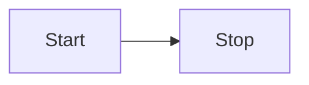

---
date: 2023-04-07
relatedTo: bla
author: Paulo Silva
about: teeestes
---

thats it

#test

![[Drawing 2023-04-07 18.17.13.excalidraw.png]]

```js
console.log('Hello world')
```


```C#
/*

Strategy é um padrão comportamental que permite definir uma família de algoritmos,

colocar cada um numa classe separada e tornar seus objetos intercambiáveis

*/

  

namespace strategy {

  

    class Program {

        static void Main(string[] args) {

  

            Context ctx = new Context();

  

            int[] numbers1 = {4, 3, 8, 2, 5, 1};

            ctx.setSorting(new AscendingSort());

            ctx.execute(numbers1);

  

            for (int i = 0; i < numbers1.Length; i++) {

                Console.WriteLine(numbers1[i]); // 1, 2, 3, 4, 5, 8

            }

  

            Console.WriteLine("---------------------");

  

            int[] numbers2 = {4, 3, 8, 2, 5, 1};

            ctx.setSorting(new DescendingSort());

            ctx.execute(numbers2);

  

            for (int i = 0; i < numbers2.Length; i++) {

                Console.WriteLine(numbers2[i]); // 8, 5, 4, 3, 2, 1

            }

        }

    }

  

    interface Sorting

    {

        void execute(int[] numbers);

    }

  
  

    class AscendingSort : Sorting {

        public void execute(int[] numbers) {

            Array.Sort(numbers);

        }

    }

  
  

    class DescendingSort : Sorting {

        public void execute(int[] numbers) {

            Array.Sort(numbers);

            Array.Reverse(numbers);

        }

    }

  

    class Context {

        public Sorting sorting = null!;

  

        public void setSorting(Sorting sorting) {

            this.sorting = sorting;

        }

  

        public void execute(int[] numbers) {

            this.sorting.execute(numbers);

        }

    }

}
```

$$
\pi \frac{1}{2}
$$


Math is cool with $\pi$


```plantuml
Bob -> Alice : hello
Alice -> Wonderland: hello
Wonderland -> next: hello
next -> Last: hello
Last -> next: hello
next -> Wonderland : hello
Wonderland -> Alice : hello
Alice -> Bob: hello
```




![[Untitled Diagram.svg]]


```dataview
List 
FROM #nature OR #natureza 
```
